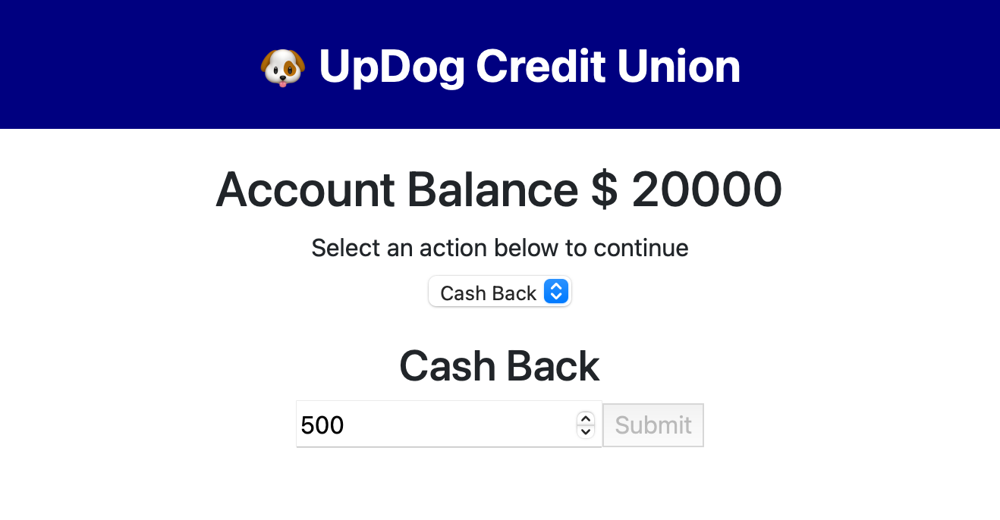

# ATM-Exercise
MITxPRO Week 15 Exercise - Working with Simple Components

## Description
This app functions as a bank ATM that lets you deposit and withdrawl amounts from a fake bank account. The user cannot do anything before deciding to withdrawl or deposit money and the user cannot take out more money than is available. This project's focus was on working with state and adding logic to prevent the user from taking too much money.

## How to run
Download all of the files to the same directory, making sure to keep the same file structure in place. Load the index.html file in a browser to start the program. Money must be depositied first before the user can get any cash back.

## Future Improvements
Future improvements could be to have a history of transactions that the user could export in a statement.

## Licence Info
Code written by Arnold Schaefer using starter code from the MITxPRO full stack development bootcamp course.
